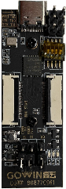
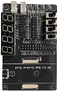

# MagicJellyBean

MagicJellyBean is an organization established to enable hobbyists, academic researchers and electronic enthusiasts with FPGA and microcontroller capabilities for embedded edge electronics projects. The intent is to create a community of like-minded individuals who can share ideas, projects and wisdom in the FPGA and microcontroller field through an affordable and easy to use platform.

## MiniStar_Board

Enables a seamless connection between programmable logic devices and embedded processors. It is compatible with a wide range of peripheral device standards, significantly reduces user costs, and can be widely used in industrial, communication, servo drive, and other fields.

### Features:

* Low Cost FPGA+MCU Embedded Computer Board

* GOWIN GW1NS-4C µSoC FPGA

* 4.6K LUT FPGA Fabric

* ARM Cortex-M3 Embedded MCU

* Embedded 256Kbit Flash

* High Speed Flex Connectors for GPIO and LVDS IO

* Selectable IO Voltages

* USB-C to JTAG Programmer

* J-LINK Debugger Header

* 27Mhz Mems Oscillator

* 64-Mbit external SPI Flash

* 2 - Push Buttons, 2 – User LEDs

* Power LED

## MiniStar Experiment Board

Take your MiniStar board to the next level with this fully compatible experimental board. Explore your programmable logic device to the limits!

### Features:

* High Speed Flex Connectors to MagicStar
* 4 – Toggle Switches
* 4 – Push Buttons
* Four Digit Seven-Segment Display
* Three 0.1” headers
* 8 - LEDs

## Software

* [Gowin EDA Student Edition (FPGA Development Software)](https://drive.google.com/drive/folders/1lCN5LGNrJmQov_gWzd2o9VdP-WFYjeam?usp=sharing)
* [Gowin GMD Student Edition (MCU Development Software)](https://drive.google.com/drive/folders/1DBQXg3YYJZKCnIAQ5HK-k8dYCcSMy6vi?usp=sharing)

## About Us

MagicJellyBean is an organization established to enable hobbyists, academic researchers and electronic enthusiasts with FPGA and microcontroller capabilities for embedded edge electronics projects. The intent is to create a community of like-minded individuals who can share ideas, projects and wisdom in the FPGA and microcontroller field through an affordable and easy to use platform.

## Links

* [Reddit](https://www.reddit.com/r/magicjellybeanfpga/)
* [Github Discussions](https://github.com/magicjellybeanfpga/MiniStar/discussions)
* [Github Issues](https://github.com/magicjellybeanfpga/MiniStar/issues/)

## Demo Videos

## Directory Information:

*/pic - high res and thumbnail pictures of the minieye and accessory boards and Demo videos

*/doc - user guide 

*/pcb - schematic pdfs

*/rtl - FPGA example designs

*/sw - any additional software for the examples
 

